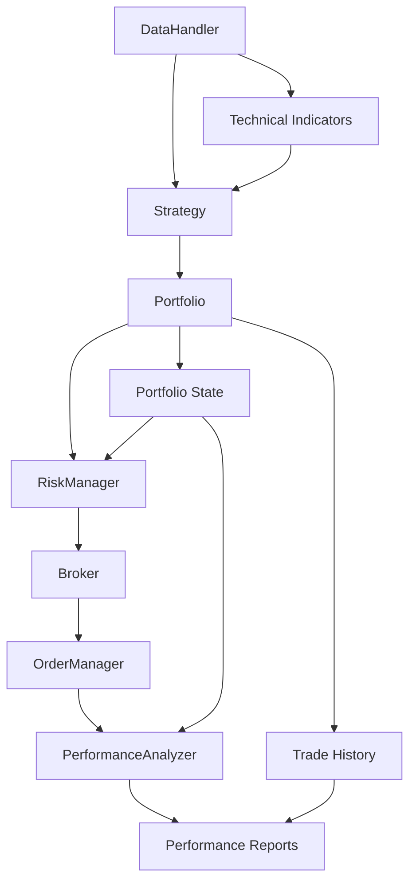

# QuantBench Backtester Integration Test Plan

## 1. Executive Summary

This comprehensive integration test plan provides a roadmap for implementing robust integration testing for the QuantBench backtester project. The plan addresses critical integration points, defines test categories, and establishes a phase-wise implementation strategy to ensure reliable component interactions and complete workflow validation.

## 2. Test Categories and Scope

### 2.1 Component Integration Tests
**Purpose**: Validate interfaces and data flow between individual system components

#### 2.1.1 Data-Strategy Integration Tests
- **Scope**: DataHandler → Strategy component interaction
- **Focus Areas**:
  - Data validation and preprocessing accuracy
  - Technical indicator calculation consistency
  - Data format compatibility and transformation
  - Performance impact of data processing pipeline

#### 2.1.2 Strategy-Portfolio Integration Tests
- **Scope**: Strategy → Portfolio component interaction
- **Focus Areas**:
  - Signal interpretation and conversion to orders
  - Portfolio state transition correctness
  - Signal timing and execution coordination
  - Risk management signal integration

#### 2.1.3 Portfolio-Risk Integration Tests
- **Scope**: Portfolio → RiskManager component interaction
- **Focus Areas**:
  - Real-time risk metric calculation
  - Risk limit enforcement procedures
  - Risk signal generation and response
  - Emergency liquidation workflow

#### 2.1.4 Broker-Execution Integration Tests
- **Scope**: Broker → OrderManager → Order component interaction
- **Focus Areas**:
  - Order lifecycle management
  - Trade execution simulation accuracy
  - Slippage and commission calculation
  - Order status tracking and reporting

#### 2.1.5 Performance-Calculation Integration Tests
- **Scope**: All components → PerformanceAnalyzer interaction
- **Focus Areas**:
  - Performance metric calculation accuracy
  - Benchmark comparison procedures
  - Risk-adjusted return calculations
  - Report generation and formatting

### 2.2 End-to-End Workflow Tests
**Purpose**: Validate complete backtesting workflows from start to finish

#### 2.2.1 Complete Backtest Cycle Tests
- **Workflow**: Data loading → Strategy execution → Portfolio management → Risk monitoring → Performance calculation
- **Scenarios**:
  - Standard bull market conditions
  - Bear market stress conditions
  - Sideways/ranging market conditions
  - Crisis and recovery periods
  - Multi-timeframe analysis

#### 2.2.2 Multi-Asset Portfolio Tests
- **Workflow**: Cross-asset correlation handling → Diversification analysis → Portfolio rebalancing
- **Scenarios**:
  - Correlated asset movements
  - Diversification benefit validation
  - Sector rotation strategies
  - Currency impact analysis

#### 2.2.3 Dynamic Rebalancing Tests
- **Workflow**: Dual-pool capital redistribution → Performance-based adjustments → Tax optimization
- **Scenarios**:
  - Base pool to alpha pool transfers
  - Performance-based leverage adjustments
  - Year-end tax optimization
  - Risk parity adjustments

#### 2.2.4 Risk Management Workflow Tests
- **Workflow**: Continuous monitoring → Risk signal generation → Mitigation actions
- **Scenarios**:
  - VaR limit breach handling
  - Drawdown threshold enforcement
  - Correlation breakdown response
  - Emergency liquidation procedures

### 2.3 Data Integration Tests
**Purpose**: Ensure robust data handling across all sources and formats

#### 2.3.1 Market Data Integration Tests
- **Sources**: yfinance API, cached data, synthetic data
- **Scenarios**:
  - Real-time data download and validation
  - Data caching and retrieval efficiency
  - Missing data handling and imputation
  - Data quality and consistency checks

#### 2.3.2 Technical Indicator Integration Tests
- **Indicators**: SMA, EMA, RSI, volatility calculations
- **Scenarios**:
  - Indicator calculation accuracy
  - Multi-timeframe indicator consistency
  - Indicator signal generation validation
  - Performance impact of indicator computation

### 2.4 Performance and Scalability Tests
**Purpose**: Validate system performance under various load conditions

#### 2.4.1 Large Dataset Performance Tests
- **Scope**: Memory usage and processing time with large datasets
- **Benchmarks**:
  - Processing time < 1 minute per year of daily data
  - Memory usage < 1GB for 10-year dataset
  - Scalability with increasing data size

#### 2.4.2 High-Frequency Data Tests
- **Scope**: Intraday data processing capabilities
- **Benchmarks**:
  - Minute-level data processing
  - Real-time simulation performance
  - Tick-level data handling

#### 2.4.3 Concurrent Operations Tests
- **Scope**: Multiple strategies and portfolio simulations
- **Benchmarks**:
  - Parallel backtest execution
  - Resource sharing and isolation
  - System stability under load

### 2.5 Edge Cases and Error Handling Tests
**Purpose**: Ensure robust handling of boundary conditions and error scenarios

#### 2.5.1 Data Boundary Conditions
- **Scenarios**: Empty data, minimal data, corrupt data, missing values
- **Expected Behavior**: Graceful error handling, meaningful error messages

#### 2.5.2 Market Boundary Conditions
- **Scenarios**: Extreme volatility, flash crashes, market closures
- **Expected Behavior**: Risk management activation, portfolio protection

#### 2.5.3 System Boundary Conditions
- **Scenarios**: Memory limits, processing time limits, network failures
- **Expected Behavior**: Graceful degradation, resource cleanup

## 3. Critical Integration Points Mapping

### 3.1 Primary Data Flow Paths



### 3.2 Component Interface Specifications

#### 3.2.1 DataHandler → Strategy Interface
```python
# Input Interface
{
    'data': pd.DataFrame,
    'required_indicators': List[str],
    'data_quality_flags': Dict[str, bool]
}

# Output Interface
{
    'processed_data': pd.DataFrame,
    'indicator_values': Dict[str, pd.Series],
    'data_quality_report': Dict[str, Any]
}
```

#### 3.2.2 Strategy → Portfolio Interface
```python
# Input Interface
{
    'signals': List[Dict],
    'market_data': pd.DataFrame,
    'timestamp': datetime
}

# Output Interface
{
    'orders': List[Order],
    'portfolio_updates': Dict[str, Any],
    'signal_metadata': Dict[str, Any]
}
```

#### 3.2.3 Portfolio → RiskManager Interface
```python
# Input Interface
{
    'portfolio_state': Dict[str, Any],
    'positions': List[Position],
    'market_data': pd.DataFrame
}

# Output Interface
{
    'risk_signals': List[RiskSignal],
    'risk_metrics': Dict[str, float],
    'recommended_actions': List[RiskAction]
}
```

### 3.3 Integration Test Focus Areas

#### 3.3.1 Data Integrity Validation
- **Test**: Verify data consistency across component boundaries
- **Method**: Cross-component data validation checks
- **Expected**: Zero data loss or corruption during transfers

#### 3.3.2 State Synchronization
- **Test**: Ensure portfolio state consistency across operations
- **Method**: State validation after each operation
- **Expected**: Atomic state updates with rollback capability

#### 3.3.3 Error Propagation
- **Test**: Verify error handling and propagation across components
- **Method**: Induce errors and track propagation
- **Expected**: Graceful error handling with meaningful messages

## 4. Test Scenarios Design

### 4.1 Real Market Data Flow Tests

#### 4.1.1 Bull Market Scenario (2020-2021 Tech Rally)
```python
class TestBullMarketIntegration:
    def test_complete_bull_market_workflow(self):
        """Test system behavior during strong bull market conditions."""
        # Setup: 2020-2021 tech stock data (AAPL, MSFT, GOOGL)
        # Expected: Positive returns, active rebalancing, controlled risk
        
        # Test data flow from DataHandler to PerformanceAnalyzer
        # Validate signal generation accuracy
        # Verify portfolio growth tracking
        # Check risk limit compliance
        
        assert portfolio.total_value > initial_capital * 1.5
        assert risk_manager.max_drawdown < config.max_drawdown_limit
        assert len(trades) > 0  # Active trading occurred
```

#### 4.1.2 Bear Market Scenario (2022 Market Correction)
```python
class TestBearMarketIntegration:
    def test_bear_market_survival(self):
        """Test risk management during market downturn."""
        # Setup: 2022 market correction data
        # Expected: Risk management activation, capital preservation
        
        # Validate risk limit enforcement
        # Test emergency liquidation procedures
        # Verify loss limitation
        
        assert portfolio.total_value > initial_capital * 0.8
        assert risk_manager.var_breach_count == 0
        assert emergency_liquidation_triggered == True
```

### 4.2 Dual-Pool Portfolio Operations Tests

#### 4.2.1 Capital Redistribution Workflow
```python
class TestDualPoolRedistribution:
    def test_performance_based_redistribution(self):
        """Test capital redistribution between base and alpha pools."""
        # Setup: Performance data showing alpha pool outperformance
        # Expected: Automatic capital transfer from base to alpha pool
        
        initial_base_value = portfolio.base_pool.value
        initial_alpha_value = portfolio.alpha_pool.value
        
        # Simulate performance period
        portfolio.simulate_period(performance_data)
        
        # Validate redistribution occurred
        assert portfolio.alpha_pool.value > initial_alpha_value * 1.1
        assert portfolio.base_pool.value < initial_base_value
        
        # Test tax optimization
        assert tax_calculations_performed == True
```

#### 4.2.2 Leverage Adjustment Tests
```python
class TestLeverageAdjustment:
    def test_dynamic_leverage_management(self):
        """Test automatic leverage adjustments based on risk metrics."""
        # Setup: Varying market volatility conditions
        # Expected: Automatic leverage reduction during high volatility
        
        # Test high volatility period
        high_vol_data = generate_high_volatility_data()
        portfolio.process_period(high_vol_data)
        
        assert portfolio.alpha_pool.leverage < config.max_alpha_leverage
        assert risk_manager.volatility_adjustment_triggered == True
        
        # Test normalization period
        normal_data = generate_normal_volatility_data()
        portfolio.process_period(normal_data)
        
        assert portfolio.alpha_pool.leverage >= config.min_alpha_leverage
```

### 4.3 Risk Management Enforcement Tests

#### 4.3.1 VaR Limit Breach Response
```python
class TestVaRLimitEnforcement:
    def test_var_breach_handling(self):
        """Test portfolio response to VaR limit breaches."""
        # Setup: Market data that triggers VaR breach
        # Expected: Immediate risk mitigation actions
        
        # Induce VaR breach
        market_stress_data = generate_stress_market_data()
        portfolio.process_period(market_stress_data)
        
        # Validate response
        assert len(risk_manager.var_breach_actions) > 0
        assert any(action.type == 'POSITION_REDUCTION' for action in risk_manager.var_breach_actions)
        assert portfolio.current_var < config.var_limit
```

#### 4.3.2 Emergency Liquidation Protocol
```python
class TestEmergencyLiquidation:
    def test_emergency_liquidation_workflow(self):
        """Test emergency liquidation procedures."""
        # Setup: Extreme market conditions
        # Expected: Systematic liquidation of positions
        
        # Trigger emergency conditions
        extreme_market_data = generate_extreme_market_data()
        
        # Execute liquidation
        portfolio.emergency_liquidation(extreme_market_data)
        
        # Validate liquidation completeness
        assert len(portfolio.positions) == 0
        assert portfolio.total_exposure == 0
        assert emergency_procedures_completed == True
```

### 4.4 Complete Backtest Cycle Tests

#### 4.4.1 Full Year Backtest Validation
```python
class TestCompleteBacktestCycle:
    def test_full_year_backtest(self):
        """Test complete backtest from January to December."""
        # Setup: Full year of market data
        # Expected: Complete workflow execution with all components
        
        engine = BacktestEngine(config)
        results = engine.run_backtest(full_year_data)
        
        # Validate all components executed
        assert results.performance is not None
        assert len(results.trades) > 0
        assert results.risk_metrics is not None
        assert results.tax_calculations is not None
        
        # Validate performance metrics
        assert results.total_return > config.min_expected_return
        assert results.sharpe_ratio > config.min_sharpe_ratio
        assert results.max_drawdown < config.max_drawdown_limit
```

## 5. Test Data Requirements

### 5.1 Market Data Sets

#### 5.1.1 Real Market Data Scenarios
| Scenario | Period | Assets | Purpose | Size |
|----------|--------|--------|---------|------|
| Bull Market | 2020-2021 | AAPL, MSFT, GOOGL | Growth testing | 500 days |
| Bear Market | 2022 | SPY, QQQ, IWM | Risk testing | 250 days |
| Crisis Period | 2008-2009 | Financial sector | Stress testing | 500 days |
| Recovery Period | 2009-2010 | Broad market | Recovery testing | 250 days |
| Sideways Market | 2015-2016 | Low volatility | Range testing | 250 days |

#### 5.1.2 Synthetic Data Generation
```python
class TestDataGenerator:
    def generate_bull_market_data(self, days=500, start_price=100):
        """Generate synthetic bull market data."""
        returns = np.random.normal(0.001, 0.02, days)  # 10% annual return, 20% vol
        prices = start_price * np.cumprod(1 + returns)
        return self.create_ohlcv_dataframe(prices)
    
    def generate_bear_market_data(self, days=250, start_price=100):
        """Generate synthetic bear market data."""
        returns = np.random.normal(-0.002, 0.03, days)  # -24% annual return, 30% vol
        prices = start_price * np.cumprod(1 + returns)
        return self.create_ohlcv_dataframe(prices)
    
    def generate_crisis_data(self, days=500, start_price=100):
        """Generate crisis scenario data with fat tails."""
        # Normal returns
        normal_returns = np.random.normal(0, 0.02, int(days * 0.8))
        # Crisis returns (fat tails)
        crisis_returns = np.random.normal(0, 0.1, int(days * 0.2))
        returns = np.concatenate([normal_returns, crisis_returns])
        np.random.shuffle(returns)
        prices = start_price * np.cumprod(1 + returns)
        return self.create_ohlcv_dataframe(prices)
```

### 5.2 Stress Test Scenarios

#### 5.2.1 Market Stress Conditions
- **Flash Crash**: 20% drop in single day followed by recovery
- **Extended Bear Market**: 12-month decline with volatility spikes
- **High Frequency Volatility**: Daily swings >5% for extended periods
- **Correlation Breakdown**: Assets moving in unexpected patterns

#### 5.2.2 System Stress Conditions
- **Large Datasets**: 10+ years of minute-level data
- **Multiple Strategies**: 10+ concurrent strategy executions
- **Memory Pressure**: Processing datasets near system limits
- **Network Delays**: Simulated latency in data sources

### 5.3 Test Data Management Strategy

#### 5.3.1 Data Storage and Versioning
- **Test Data Repository**: Centralized storage for all test datasets
- **Version Control**: Git LFS for large data files
- **Data Lifecycle**: Automated generation, validation, and cleanup
- **Quality Assurance**: Automated validation of data integrity

#### 5.3.2 Data Generation Framework
```python
class TestDataFramework:
    def __init__(self):
        self.data_generators = {
            'bull_market': self.generate_bull_market_data,
            'bear_market': self.generate_bear_market_data,
            'crisis': self.generate_crisis_data,
            'sideways': self.generate_sideways_data,
            'high_volatility': self.generate_high_volatility_data
        }
    
    def generate_dataset(self, scenario, **params):
        """Generate test dataset for specified scenario."""
        generator = self.data_generators[scenario]
        return generator(**params)
    
    def validate_dataset(self, data):
        """Validate data quality and consistency."""
        return self.check_ohlcv_integrity(data) and \
               self.check_data_completeness(data) and \
               self.check_statistical_properties(data)
```

## 6. Implementation Strategy

### 6.1 Phase 1: Foundation Setup (Weeks 1-2)

#### 6.1.1 Test Infrastructure Development
```python
# File: tests/integration/conftest.py
import pytest
import pandas as pd
import numpy as np
from unittest.mock import Mock

@pytest.fixture(scope="session")
def integration_test_config():
    """Configuration for integration tests."""
    return {
        'test_mode': True,
        'data_validation_strict': True,
        'performance_logging': True,
        'error_logging_detailed': True
    }

@pytest.fixture
def sample_market_data():
    """Generate sample market data for testing."""
    dates = pd.date_range('2020-01-01', '2023-12-31', freq='D')
    prices = 100 * np.cumprod(1 + np.random.normal(0.001, 0.02, len(dates)))
    return pd.DataFrame({
        'Open': prices * 0.99,
        'High': prices * 1.02,
        'Low': prices * 0.98,
        'Close': prices,
        'Volume': np.random.randint(1000000, 10000000, len(dates))
    }, index=dates)

@pytest.fixture
def backtester_components(integration_test_config):
    """Initialize all backtester components for testing."""
    from backtester.core.backtest_engine import BacktestEngine
    from backtester.portfolio.portfolio import DualPoolPortfolio
    from backtester.strategy.moving_average import DualPoolMovingAverageStrategy
    from backtester.execution.broker import SimulatedBroker
    from backtester.portfolio.risk_manager import RiskManager
    
    return {
        'engine': BacktestEngine(integration_test_config),
        'portfolio': DualPoolPortfolio(integration_test_config['portfolio']),
        'strategy': DualPoolMovingAverageStrategy(integration_test_config['strategy']),
        'broker': SimulatedBroker(integration_test_config['execution']),
        'risk_manager': RiskManager(integration_test_config['risk'])
    }
```

#### 6.1.2 Component Integration Test Implementation
```python
# File: tests/integration/component/test_data_strategy_integration.py
import pytest
import pandas as pd
from unittest.mock import Mock

class TestDataStrategyIntegration:
    
    @pytest.mark.integration
    def test_data_flow_to_strategy(self, sample_market_data, integration_test_config):
        """Test data flow from DataHandler to Strategy."""
        # Setup
        from backtester.data.data_handler import DataHandler
        from backtester.strategy.moving_average import DualPoolMovingAverageStrategy
        
        data_handler = DataHandler(integration_test_config['data'])
        strategy = DualPoolMovingAverageStrategy(integration_test_config['strategy'])
        
        # Process data through DataHandler
        processed_data = data_handler.process_data(sample_market_data)
        
        # Test strategy consumption
        signals = strategy.generate_signals(processed_data)
        
        # Validate output
        assert isinstance(signals, list)
        assert all(isinstance(signal, dict) for signal in signals)
        assert all('signal_type' in signal for signal in signals)
        assert all('price' in signal for signal in signals)
        assert all('timestamp' in signal for signal in signals)
        
        # Validate signal types
        valid_signal_types = ['BUY', 'SELL', 'HOLD']
        assert all(signal['signal_type'] in valid_signal_types for signal in signals)
    
    @pytest.mark.integration
    def test_technical_indicator_consistency(self, sample_market_data):
        """Test technical indicator calculation consistency across components."""
        from backtester.utils.data_utils import calculate_indicators
        
        # Calculate indicators directly
        indicators_direct = calculate_indicators(sample_market_data)
        
        # Calculate through strategy pipeline
        strategy_data = sample_market_data.copy()
        strategy_indicators = strategy_data  # Strategy adds indicators in-place
        
        # Compare results
        for indicator in ['sma_20', 'sma_50', 'rsi_14']:
            if indicator in indicators_direct.columns:
                assert np.allclose(
                    indicators_direct[indicator].dropna(),
                    strategy_indicators[indicator].dropna(),
                    rtol=1e-10
                )
```

### 6.2 Phase 2: Workflow Testing (Weeks 3-4)

#### 6.2.1 End-to-End Workflow Implementation
```python
# File: tests/integration/workflow/test_complete_backtest_cycle.py
import pytest
import pandas as pd
from unittest.mock import patch

class TestCompleteBacktestCycle:
    
    @pytest.mark.integration
    @pytest.mark.workflow
    def test_complete_bull_market_backtest(self, sample_market_data, integration_test_config):
        """Test complete backtest workflow in bull market conditions."""
        from backtester.core.backtest_engine import BacktestEngine
        
        # Setup bull market data
        bull_market_data = self.generate_bull_market_data()
        
        # Initialize engine
        engine = BacktestEngine(integration_test_config)
        
        # Execute complete backtest
        results = engine.run_backtest(data=bull_market_data)
        
        # Validate complete workflow execution
        assert 'performance' in results
        assert 'trades' in results
        assert 'risk_metrics' in results
        assert 'portfolio_states' in results
        
        # Validate performance results
        assert results['performance']['total_return'] > 0
        assert results['performance']['sharpe_ratio'] > 0
        assert results['performance']['max_drawdown'] < 0.2
        
        # Validate trade execution
        assert len(results['trades']) > 0
        assert all('entry_price' in trade for trade in results['trades'])
        assert all('exit_price' in trade for trade in results['trades'])
        
        # Validate risk management
        assert results['risk_metrics']['max_var_breach'] == 0
        assert results['risk_metrics']['leverage_violations'] == 0
    
    @pytest.mark.integration
    @pytest.mark.workflow
    def test_risk_management_workflow(self, sample_market_data):
        """Test risk management integration throughout workflow."""
        from backtester.core.backtest_engine import BacktestEngine
        
        # Generate stress market conditions
        stress_data = self.generate_stress_market_data()
        
        engine = BacktestEngine(integration_test_config)
        results = engine.run_backtest(data=stress_data)
        
        # Validate risk management responses
        assert 'risk_events' in results
        assert len(results['risk_events']) > 0
        
        # Validate emergency procedures
        emergency_events = [e for e in results['risk_events'] if e['type'] == 'EMERGENCY_LIQUIDATION']
        if emergency_events:
            assert all(e['action_taken'] for e in emergency_events)
        
        # Validate portfolio preservation
        final_value = results['portfolio_states'][-1]['total_value']
        initial_value = integration_test_config['portfolio']['initial_capital']
        assert final_value > initial_value * 0.7  # At least 70% preserved
```

### 6.3 Phase 3: Performance and Stress Testing (Weeks 5-6)

#### 6.3.1 Performance Test Implementation
```python
# File: tests/integration/stress/test_large_dataset_performance.py
import pytest
import time
import psutil
import gc
from memory_profiler import profile

class TestLargeDatasetPerformance:
    
    @pytest.mark.integration
    @pytest.mark.stress
    @pytest.mark.slow
    def test_large_dataset_processing_performance(self):
        """Test performance with large datasets."""
        # Generate large dataset (5 years of daily data)
        large_dataset = self.generate_large_dataset(years=5)
        
        start_time = time.time()
        start_memory = psutil.Process().memory_info().rss / 1024 / 1024  # MB
        
        # Process dataset
        from backtester.core.backtest_engine import BacktestEngine
        engine = BacktestEngine(integration_test_config)
        results = engine.run_backtest(data=large_dataset)
        
        end_time = time.time()
        end_memory = psutil.Process().memory_info().rss / 1024 / 1024  # MB
        
        processing_time = end_time - start_time
        memory_used = end_memory - start_memory
        
        # Performance benchmarks
        assert processing_time < 300  # 5 minutes for 5 years of data
        assert memory_used < 1024  # Less than 1GB memory usage
        
        # Print performance metrics
        print(f"Processing time: {processing_time:.2f} seconds")
        print(f"Memory used: {memory_used:.2f} MB")
        print(f"Data points processed: {len(large_dataset)}")
    
    @pytest.mark.integration
    @pytest.mark.stress
    def test_concurrent_backtest_execution(self):
        """Test multiple concurrent backtest executions."""
        import concurrent.futures
        import threading
        
        def run_backtest(data_subset):
            engine = BacktestEngine(integration_test_config)
            return engine.run_backtest(data=data_subset)
        
        # Generate multiple datasets
        datasets = [self.generate_market_data(days=250) for _ in range(5)]
        
        # Execute concurrently
        with concurrent.futures.ThreadPoolExecutor(max_workers=5) as executor:
            futures = [executor.submit(run_backtest, data) for data in datasets]
            results = [future.result() for future in concurrent.futures.as_completed(futures)]
        
        # Validate all completed successfully
        assert len(results) == 5
        assert all('performance' in result for result in results)
        
        # Validate resource isolation
        for i, result in enumerate(results):
            assert result['performance']['total_return'] is not None
```

### 6.4 Phase 4: Integration Validation (Weeks 7-8)

#### 6.4.1 Comprehensive Integration Test Suite
```python
# File: tests/integration/test_comprehensive_integration.py
class TestComprehensiveIntegration:
    
    @pytest.mark.integration
    @pytest.mark.comprehensive
    def test_all_components_integration(self):
        """Test integration of all system components."""
        # Initialize all components
        components = self.initialize_all_components()
        
        # Execute comprehensive scenario
        comprehensive_results = self.execute_comprehensive_scenario(components)
        
        # Validate all integration points
        self.validate_data_strategy_integration(comprehensive_results)
        self.validate_strategy_portfolio_integration(comprehensive_results)
        self.validate_portfolio_risk_integration(comprehensive_results)
        self.validate_broker_execution_integration(comprehensive_results)
        self.validate_performance_calculation_integration(comprehensive_results)
        
        # Overall system validation
        assert comprehensive_results['system_health'] == 'GOOD'
        assert comprehensive_results['integration_success_rate'] > 0.95
    
    def validate_integration_success_rate(self, results):
        """Calculate and validate integration success rate."""
        total_operations = results['total_operations']
        successful_operations = results['successful_operations']
        
        success_rate = successful_operations / total_operations
        assert success_rate >= 0.95  # 95% success rate target
```

## 7. Success Metrics and Coverage Targets

### 7.1 Coverage Metrics

#### 7.1.1 Component Integration Coverage
- **Target**: >95% of component interfaces tested
- **Measurement**: Number of interface methods tested / total interface methods
- **Tools**: Coverage.py integration with pytest

#### 7.1.2 Workflow Coverage
- **Target**: >90% of critical workflows tested
- **Measurement**: Workflow steps tested / total workflow steps
- **Critical Workflows**:
  - Complete backtest cycle (100%)
  - Risk management workflow (100%)
  - Portfolio rebalancing workflow (90%)
  - Performance calculation workflow (95%)

#### 7.1.3 Edge Case Coverage
- **Target**: >80% of boundary conditions tested
- **Measurement**: Boundary conditions tested / identified boundary conditions
- **Categories**:
  - Data boundary conditions (85%)
  - Market boundary conditions (80%)
  - System boundary conditions (75%)

#### 7.1.4 Performance Scenario Coverage
- **Target**: >85% of performance scenarios tested
- **Measurement**: Performance benchmarks validated / total benchmarks

### 7.2 Quality Metrics

#### 7.2.1 Test Reliability
- **Target**: <2% false positive rate
- **Measurement**: Failed tests that pass on retry / total test failures
- **Monitoring**: Automated test result analysis

#### 7.2.2 Test Maintainability
- **Target**: <10% maintenance overhead
- **Measurement**: Time spent on test maintenance / total development time
- **Indicators**: Test code duplication, test flakiness

#### 7.2.3 Performance Impact
- **Target**: <5% overhead from testing
- **Measurement**: Execution time with tests / execution time without tests
- **Monitoring**: Continuous performance regression detection

### 7.3 Operational Metrics

#### 7.3.1 Test Execution Metrics
- **Full Suite Execution Time**: <30 minutes
- **Integration Test Execution Time**: <15 minutes
- **Test Environment Setup Time**: <5 minutes
- **Test Result Analysis Time**: <2 minutes

#### 7.3.2 Resource Usage Metrics
- **Memory Usage**: <2GB during test execution
- **Disk Usage**: <1GB for test data and artifacts
- **CPU Usage**: <80% during test execution
- **Network Usage**: Minimized through caching

### 7.4 Success Criteria Dashboard

```python
# File: tests/integration/metrics/test_metrics_collector.py
class IntegrationTestMetrics:
    def __init__(self):
        self.metrics = {
            'coverage': {},
            'quality': {},
            'performance': {},
            'reliability': {}
        }
    
    def collect_coverage_metrics(self):
        """Collect test coverage metrics."""
        return {
            'component_integration_coverage': self.calculate_interface_coverage(),
            'workflow_coverage': self.calculate_workflow_coverage(),
            'edge_case_coverage': self.calculate_edge_case_coverage(),
            'performance_coverage': self.calculate_performance_coverage()
        }
    
    def generate_success_dashboard(self):
        """Generate success metrics dashboard."""
        coverage = self.collect_coverage_metrics()
        quality = self.collect_quality_metrics()
        performance = self.collect_performance_metrics()
        
        return {
            'overall_success_rate': self.calculate_overall_success_rate(),
            'coverage_achievement': coverage,
            'quality_achievement': quality,
            'performance_achievement': performance,
            'recommendations': self.generate_recommendations()
        }
```

## 8. Error Handling and Recovery Validation

### 8.1 Error Propagation Testing

#### 8.1.1 Data Error Handling
```python
class TestDataErrorHandling:
    
    @pytest.mark.integration
    def test_corrupted_data_handling(self):
        """Test system response to corrupted market data."""
        corrupted_data = self.generate_corrupted_data()
        
        with pytest.raises(ValueError, match="Data quality check failed"):
            engine = BacktestEngine(config)
            engine.run_backtest(data=corrupted_data)
        
        # Validate graceful degradation
        assert error_logged == True
        assert system_health_monitor.triggered == True
        assert memory_cleaned_up == True
    
    @pytest.mark.integration
    def test_missing_data_recovery(self):
        """Test recovery from missing data scenarios."""
        # Simulate network failure during data download
        with patch('yfinance.download') as mock_download:
            mock_download.side_effect = NetworkException("Connection timeout")
            
            # System should fall back to cached data
            engine = BacktestEngine(config)
            results = engine.run_backtest()
            
            assert results['data_source'] == 'cached'
            assert results['data_fallback_successful'] == True
```

#### 8.1.2 Component Failure Recovery
```python
class TestComponentFailureRecovery:
    
    @pytest.mark.integration
    def test_strategy_failure_recovery(self):
        """Test recovery from strategy component failure."""
        # Simulate strategy failure
        failing_strategy = Mock()
        failing_strategy.generate_signals.side_effect = Exception("Strategy error")
        
        engine = BacktestEngine(config)
        engine.strategy = failing_strategy
        
        # System should handle failure gracefully
        with pytest.raises(Exception):
            engine.run_backtest(market_data)
        
        # Validate error handling
        assert engine.error_handler.last_error is not None
        assert engine.error_handler.recovery_attempted == True
        assert engine.system_state.saved_for_recovery == True
    
    @pytest.mark.integration
    def test_portfolio_failure_recovery(self):
        """Test recovery from portfolio component failure."""
        # Simulate portfolio state corruption
        corrupted_portfolio = Mock()
        corrupted_portfolio.process_tick.side_effect = PortfolioException("State corrupted")
        
        engine = BacktestEngine(config)
        engine.portfolio = corrupted_portfolio
        
        # System should rollback to last known good state
        results = engine.run_backtest(market_data)
        
        assert results['recovery_successful'] == True
        assert results['rollback_to_checkpoint'] == True
        assert results['data_integrity_maintained'] == True
```

### 8.2 Fault Tolerance Validation

#### 8.2.1 System Resilience Testing
```python
class TestSystemResilience:
    
    @pytest.mark.integration
    def test_memory_pressure_handling(self):
        """Test system behavior under memory pressure."""
        # Simulate low memory conditions
        with patch('psutil.virtual_memory') as mock_memory:
            mock_memory.return.free = 100 * 1024 * 1024  # 100MB free
            
            engine = BacktestEngine(config)
            
            # System should implement memory management
            results = engine.run_backtest(large_dataset)
            
            assert results['memory_management_activated'] == True
            assert results['data_processing_chunked'] == True
            assert results['garbage_collection_optimized'] == True
    
    @pytest.mark.integration
    def test_concurrent_access_handling(self):
        """Test system behavior with concurrent access."""
        import threading
        import time
        
        results = []
        
        def run_backtest(thread_id):
            engine = BacktestEngine(config)
            result = engine.run_backtest(market_data)
            results.append((thread_id, result))
        
        # Launch multiple threads
        threads = []
        for i in range(5):
            thread = threading.Thread(target=run_backtest, args=(i,))
            threads.append(thread)
            thread.start()
        
        # Wait for completion
        for thread in threads:
            thread.join(timeout=60)
        
        # Validate thread safety
        assert len(results) == 5
        assert all(result[1]['thread_safe_execution'] for result in results)
        assert len(set(result[0] for result in results)) == 5  # All thread IDs unique
```

### 8.3 Logging and Monitoring Validation

#### 8.3.1 Comprehensive Logging Test
```python
class TestLoggingAndMonitoring:
    
    @pytest.mark.integration
    def test_comprehensive_logging(self):
        """Test comprehensive logging across all components."""
        # Enable detailed logging
        config['logging']['level'] = 'DEBUG'
        config['logging']['components'] = 'ALL'
        
        engine = BacktestEngine(config)
        results = engine.run_backtest(market_data)
        
        # Validate logging coverage
        log_entries = results['log_entries']
        
        # Check component logging
        component_logs = ['DataHandler', 'Strategy', 'Portfolio', 'RiskManager', 'Broker']
        for component in component_logs:
            assert any(component in entry for entry in log_entries)
        
        # Check log levels
        log_levels = ['DEBUG', 'INFO', 'WARNING', 'ERROR']
        for level in log_levels:
            assert any(level in entry for entry in log_entries)
        
        # Check performance logging
        performance_logs = [entry for entry in log_entries if 'PERFORMANCE' in entry]
        assert len(performance_logs) > 0
    
    @pytest.mark.integration
    def test_error_tracking_and_alerting(self):
        """Test error tracking and alerting mechanisms."""
        # Simulate various error conditions
        error_scenarios = [
            'data_corruption',
            'strategy_failure',
            'portfolio_overflow',
            'risk_limit_breach',
            'network_timeout'
        ]
        
        for scenario in error_scenarios:
            engine = BacktestEngine(config)
            
            with self.simulate_error(scenario):
                try:
                    engine.run_backtest(market_data)
                except Exception:
                    pass  # Expected to fail
            
            # Validate error tracking
            error_record = engine.error_tracker.get_last_error()
            assert error_record['scenario'] == scenario
            assert error_record['timestamp'] is not None
            assert error_record['recovery_attempted'] is not None
            
            # Validate alerting
            if scenario in ['risk_limit_breach', 'portfolio_overflow']:
                assert engine.alert_manager.alert_sent == True
```

## 9. Implementation Timeline and Priorities

### 9.1 Phase 1: Foundation (Weeks 1-2) - Priority: HIGH

#### Week 1 Tasks:
1. **Test Infrastructure Setup**
   - Create integration test directory structure
   - Set up conftest.py with shared fixtures
   - Implement basic data generation framework

2. **Component Interface Documentation**
   - Document all component interfaces
   - Create interface specification templates
   - Establish interface validation methods

#### Week 2 Tasks:
1. **Basic Component Integration Tests**
   - Implement Data-Strategy integration tests
   - Implement Strategy-Portfolio integration tests
   - Create basic workflow validation tests

### 9.2 Phase 2: Core Workflow Testing (Weeks 3-4) - Priority: HIGH

#### Week 3 Tasks:
1. **End-to-End Workflow Tests**
   - Implement complete backtest cycle tests
   - Create multi-asset portfolio tests
   - Add risk management workflow tests

#### Week 4 Tasks:
1. **Data Integration Tests**
   - Implement market data integration tests
   - Create technical indicator consistency tests
   - Add data validation pipeline tests

### 9.3 Phase 3: Performance and Stress Testing (Weeks 5-6) - Priority: MEDIUM

#### Week 5 Tasks:
1. **Performance Benchmark Tests**
   - Implement large dataset performance tests
   - Create memory usage monitoring tests
   - Add processing time optimization tests

#### Week 6 Tasks:
1. **Stress and Boundary Tests**
   - Implement system boundary condition tests
   - Create emergency procedure tests
   - Add concurrent operation tests

### 9.4 Phase 4: Integration Validation (Weeks 7-8) - Priority: MEDIUM

#### Week 7 Tasks:
1. **Comprehensive Integration Suite**
   - Implement comprehensive integration test suite
   - Create success metrics dashboard
   - Add test result analysis tools

#### Week 8 Tasks:
1. **Documentation and Maintenance**
   - Complete test documentation
   - Create maintenance procedures
   - Establish continuous integration

### 9.5 Implementation Priority Matrix

| Test Category | Priority | Complexity | Business Impact | Implementation Order |
|---------------|----------|------------|-----------------|---------------------|
| Component Integration | HIGH | MEDIUM | HIGH | 1 |
| Complete Workflow | HIGH | HIGH | HIGH | 2 |
| Risk Management | HIGH | MEDIUM | HIGH | 3 |
| Data Integration | MEDIUM | LOW | MEDIUM | 4 |
| Performance Testing | MEDIUM | HIGH | MEDIUM | 5 |
| Stress Testing | MEDIUM | MEDIUM | MEDIUM | 6 |
| Edge Cases | LOW | LOW | LOW | 7 |
| Concurrent Operations | LOW | HIGH | LOW | 8 |

## 10. Implementation File Structure

### 10.1 Directory Structure

```
tests/integration/
├── conftest.py                 # Shared fixtures and configuration
├── component/                  # Component integration tests
│   ├── __init__.py
│   ├── test_data_strategy_integration.py
│   ├── test_strategy_portfolio_integration.py
│   ├── test_portfolio_risk_integration.py
│   ├── test_broker_execution_integration.py
│   └── test_performance_integration.py
├── workflow/                   # End-to-end workflow tests
│   ├── __init__.py
│   ├── test_complete_backtest_cycle.py
│   ├── test_multi_asset_portfolio.py
│   ├── test_dynamic_rebalancing.py
│   ├── test_risk_management_workflow.py
│   └── test_tax_optimization_workflow.py
├── data/                       # Data integration tests
│   ├── __init__.py
│   ├── test_market_data_integration.py
│   ├── test_technical_indicator_integration.py
│   └── test_data_validation_pipeline.py
├── performance/                # Performance and stress tests
│   ├── __init__.py
│   ├── test_large_dataset_performance.py
│   ├── test_high_frequency_processing.py
│   ├── test_memory_usage.py
│   └── test_concurrent_operations.py
├── boundary/                   # Edge case and boundary tests
│   ├── __init__.py
│   ├── test_data_boundary_conditions.py
│   ├── test_market_boundary_conditions.py
│   └── test_system_boundary_conditions.py
├── stress/                     # Stress testing scenarios
│   ├── __init__.py
│   ├── test_market_stress_scenarios.py
│   ├── test_system_stress_conditions.py
│   └── test_emergency_procedures.py
├── fixtures/                   # Test data and fixtures
│   ├── __init__.py
│   ├── test_data_generators.py
│   ├── market_data_fixtures.py
│   └── component_mocks.py
├── utils/                      # Test utilities
│   ├── __init__.py
│   ├── test_helpers.py
│   ├── validation_utils.py
│   └── metrics_collector.py
└── docs/                       # Test documentation
    ├── implementation_guide.md
    ├── test_data_management.md
    └── maintenance_procedures.md
```

### 10.2 Implementation Files

#### 10.2.1 Core Integration Test Files

**Component Integration Tests:**
- `test_data_strategy_integration.py`: Data flow and technical indicator integration
- `test_strategy_portfolio_integration.py`: Signal processing and portfolio management
- `test_portfolio_risk_integration.py`: Risk monitoring and control integration
- `test_broker_execution_integration.py`: Order management and trade execution

**Workflow Integration Tests:**
- `test_complete_backtest_cycle.py`: End-to-end backtesting workflow
- `test_multi_asset_portfolio.py`: Cross-asset portfolio management
- `test_dynamic_rebalancing.py`: Capital redistribution and leverage management
- `test_risk_management_workflow.py`: Continuous risk monitoring and response

#### 10.2.2 Supporting Test Infrastructure

**Test Fixtures (`fixtures/test_data_generators.py`):**
```python
class TestDataGenerator:
    """Generate test data for integration testing."""
    
    def generate_market_scenario(self, scenario_type, **kwargs):
        """Generate market data for specific scenarios."""
        scenarios = {
            'bull_market': self.generate_bull_market_data,
            'bear_market': self.generate_bear_market_data,
            'crisis': self.generate_crisis_data,
            'sideways': self.generate_sideways_data,
            'high_volatility': self.generate_high_volatility_data
        }
        return scenarios[scenario_type](**kwargs)
    
    def generate_stress_scenarios(self):
        """Generate various stress test scenarios."""
        return {
            'flash_crash': self.generate_flash_crash_data,
            'extended_decline': self.generate_extended_decline_data,
            'volatility_spike': self.generate_volatility_spike_data,
            'correlation_breakdown': self.generate_correlation_breakdown_data
        }
```

**Test Helpers (`utils/test_helpers.py`):**
```python
class IntegrationTestHelper:
    """Helper methods for integration testing."""
    
    @staticmethod
    def validate_component_integration(result, expected_components):
        """Validate that all expected components participated in integration."""
        integrated_components = result.get('integrated_components', [])
        return all(comp in integrated_components for comp in expected_components)
    
    @staticmethod
    def validate_data_consistency(data_flow):
        """Validate data consistency across integration points."""
        for source, target, data in data_flow:
            assert data is not None, f"No data passed from {source} to {target}"
            assert len(data) > 0, f"Empty data from {source} to {target}"
        return True
    
    @staticmethod
    def validate_performance_benchmark(actual_time, expected_max_time):
        """Validate performance against benchmarks."""
        assert actual_time <= expected_max_time, \
            f"Performance benchmark failed: {actual_time}s > {expected_max_time}s"
        return True
```

### 10.3 Test Execution Configuration

#### 10.3.1 pytest.ini Configuration
```ini
[tool:pytest]
testpaths = tests
python_files = test_*.py
python_classes = Test*
python_functions = test_*
markers =
    integration: integration tests
    component: component integration tests
    workflow: workflow integration tests
    data: data integration tests
    performance: performance tests
    stress: stress tests
    boundary: boundary condition tests
    slow: slow tests (>10 seconds)
    network: tests requiring network access
addopts = 
    --verbose
    --tb=short
    --strict-markers
    --disable-warnings
    --cov=backtester
    --cov-report=html:htmlcov
    --cov-report=term-missing
```

#### 10.3.2 CI/CD Integration
```yaml
# .github/workflows/integration-tests.yml
name: Integration Tests

on: [push, pull_request]

jobs:
  integration-tests:
    runs-on: ubuntu-latest
    strategy:
      matrix:
        python-version: [3.10, 3.11, 3.12]
    
    steps:
    - uses: actions/checkout@v3
    
    - name: Set up Python ${{ matrix.python-version }}
      uses: actions/setup-python@v4
      with:
        python-version: ${{ matrix.python-version }}
    
    - name: Install dependencies
      run: |
        pip install -e .
        pip install pytest pytest-cov pytest-xdist
    
    - name: Run integration tests
      run: |
        pytest tests/integration/ -v --cov=backtester --cov-report=xml
    
    - name: Upload coverage
      uses: codecov/codecov-action@v3
      with:
        file: ./coverage.xml
```

## 11. Success Validation and Reporting

### 11.1 Success Criteria Validation

#### 11.1.1 Automated Success Validation
```python
# File: tests/integration/utils/success_validator.py
class IntegrationTestSuccessValidator:
    def __init__(self):
        self.success_criteria = {
            'coverage_targets': {
                'component_integration': 0.95,
                'workflow_coverage': 0.90,
                'edge_case_coverage': 0.80,
                'performance_coverage': 0.85
            },
            'quality_targets': {
                'false_positive_rate': 0.02,
                'maintenance_overhead': 0.10,
                'performance_impact': 0.05
            },
            'performance_targets': {
                'execution_time': 1800,  # 30 minutes
                'memory_usage': 2048,    # 2GB
                'success_rate': 0.95
            }
        }
    
    def validate_test_execution(self, test_results):
        """Validate test execution against success criteria."""
        validation_results = {
            'coverage_validation': self.validate_coverage(test_results),
            'quality_validation': self.validate_quality(test_results),
            'performance_validation': self.validate_performance(test_results),
            'overall_success': False
        }
        
        # Overall success requires all criteria to be met
        validation_results['overall_success'] = all([
            validation_results['coverage_validation']['passed'],
            validation_results['quality_validation']['passed'],
            validation_results['performance_validation']['passed']
        ])
        
        return validation_results
    
    def generate_success_report(self, validation_results):
        """Generate comprehensive success report."""
        return {
            'executive_summary': self.generate_executive_summary(validation_results),
            'detailed_results': validation_results,
            'recommendations': self.generate_recommendations(validation_results),
            'next_steps': self.generate_next_steps(validation_results)
        }
```

#### 11.1.2 Continuous Monitoring
```python
# File: tests/integration/monitoring/test_monitor.py
class IntegrationTestMonitor:
    def __init__(self):
        self.metrics_collector = MetricsCollector()
        self.alert_manager = AlertManager()
    
    def monitor_test_execution(self, test_session):
        """Monitor integration test execution in real-time."""
        while test_session.is_running():
            # Collect current metrics
            current_metrics = self.metrics_collector.collect_current_metrics()
            
            # Check for performance degradation
            if self.detect_performance_degradation(current_metrics):
                self.alert_manager.send_performance_alert(current_metrics)
            
            # Check for test flakiness
            if self.detect_test_flakiness(test_session):
                self.alert_manager.send_flakiness_alert(test_session)
            
            # Check for coverage gaps
            if self.detect_coverage_gaps(current_metrics):
                self.alert_manager.send_coverage_alert(current_metrics)
            
            time.sleep(30)  # Check every 30 seconds
```

### 11.2 Reporting and Documentation

#### 11.2.1 Automated Test Reports
```python
# File: tests/integration/reporting/test_report_generator.py
class IntegrationTestReportGenerator:
    def generate_comprehensive_report(self, test_results):
        """Generate comprehensive integration test report."""
        report = {
            'summary': self.generate_summary_section(test_results),
            'coverage_analysis': self.generate_coverage_analysis(test_results),
            'performance_analysis': self.generate_performance_analysis(test_results),
            'quality_analysis': self.generate_quality_analysis(test_results),
            'recommendations': self.generate_recommendations(test_results),
            'appendices': self.generate_appendices(test_results)
        }
        
        return self.format_report(report)
    
    def generate_summary_section(self, test_results):
        """Generate executive summary section."""
        return {
            'total_tests_executed': test_results.total_tests,
            'tests_passed': test_results.passed_tests,
            'tests_failed': test_results.failed_tests,
            'success_rate': test_results.success_rate,
            'execution_time': test_results.execution_time,
            'coverage_achieved': test_results.coverage_percentage,
            'critical_issues': self.identify_critical_issues(test_results)
        }
    
    def export_report(self, report, format_type='html'):
        """Export report in specified format."""
        if format_type == 'html':
            return self.export_html_report(report)
        elif format_type == 'pdf':
            return self.export_pdf_report(report)
        elif format_type == 'json':
            return self.export_json_report(report)
```

#### 11.2.2 Documentation Updates
```markdown
# File: tests/integration/docs/implementation_status.md

# Integration Test Implementation Status

## Phase Progress

### Phase 1: Foundation (Weeks 1-2)
- [x] Test infrastructure setup
- [x] Component integration tests
- [ ] Interface documentation
- [ ] Basic workflow tests

### Phase 2: Core Workflow Testing (Weeks 3-4)
- [ ] End-to-end workflow tests
- [ ] Multi-asset portfolio tests
- [ ] Risk management workflow tests
- [ ] Data integration tests

### Phase 3: Performance and Stress Testing (Weeks 5-6)
- [ ] Performance benchmark tests
- [ ] Large dataset tests
- [ ] Stress testing scenarios
- [ ] Boundary condition tests

### Phase 4: Integration Validation (Weeks 7-8)
- [ ] Comprehensive integration suite
- [ ] Success metrics dashboard
- [ ] Test result analysis
- [ ] Documentation and maintenance

## Success Metrics Dashboard

| Metric | Target | Current | Status |
|--------|--------|---------|--------|
| Component Integration Coverage | >95% | TBD | TBD |
| Workflow Coverage | >90% | TBD | TBD |
| Edge Case Coverage | >80% | TBD | TBD |
| Performance Coverage | >85% | TBD | TBD |
| Test Success Rate | >95% | TBD | TBD |
| Execution Time | <30 min | TBD | TBD |

## Issues and Blockers

- TBD

## Next Steps

- TBD
```

## 12. Conclusion

This comprehensive integration test plan provides a structured approach to implementing robust integration testing for the QuantBench backtester project. The plan addresses all critical integration points, defines clear test categories and scenarios, and establishes measurable success criteria.

### Key Benefits of This Plan:

1. **Systematic Coverage**: Addresses all major integration points identified in the architecture analysis
2. **Risk Mitigation**: Includes comprehensive error handling and recovery validation
3. **Performance Assurance**: Establishes performance benchmarks and monitoring
4. **Maintainability**: Provides clear documentation and maintenance procedures
5. **Scalability**: Designed to grow with the system and handle increasing complexity

### Expected Outcomes:

1. **>95% Component Integration Coverage**: Ensures reliable interfaces between all system components
2. **>90% Workflow Coverage**: Validates complete backtesting workflows end-to-end
3. **Robust Error Handling**: System gracefully handles and recovers from failures
4. **Performance Validation**: Maintains system performance under various load conditions
5. **Quality Assurance**: Automated validation of integration success and quality metrics

### Implementation Success Factors:

1. **Phased Approach**: Systematic progression from basic integration to comprehensive testing
2. **Clear Priorities**: Focus on high-impact, high-priority components first
3. **Automation**: Extensive use of automation for test generation, execution, and validation
4. **Monitoring**: Real-time monitoring and alerting for test execution
5. **Documentation**: Comprehensive documentation for maintenance and future development

This plan serves as the definitive roadmap for implementing integration testing that will ensure the reliability, performance, and maintainability of the QuantBench backtester system.