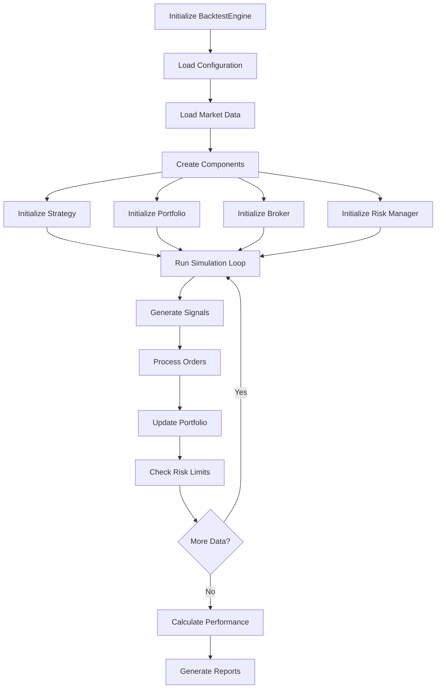

# QuantBench Backtester Architecture Analysis for Integration Testing

## Executive Summary

This document provides a comprehensive analysis of the QuantBench backtester project architecture to guide the creation of integration tests. The analysis covers the system design, component interactions, critical workflows, current testing coverage, and recommendations for comprehensive integration testing.

## 1. Project Configuration Analysis

### 1.1 Project Structure
- **Name**: quant-bench (version 0.1.0)
- **Python Requirement**: >=3.10
- **Build System**: hatchling
- **Main Package**: backtester

### 1.2 Key Dependencies
- **Data Analysis**: pandas (>=2.3.3), numpy (>=2.2.6)
- **Visualization**: matplotlib (>=3.10.7)
- **Optimization**: optuna (>=4.5.0)
- **Machine Learning**: scikit-learn (>=1.7.2), scipy (>=1.15.3)
- **Data Source**: yfinance (>=0.2.66)
- **Database**: psycopg2-binary (>=2.9.11)
- **Configuration**: pydantic (>=2.12.3)

### 1.3 Test Configuration
- **Test Framework**: pytest (>=7.0.0)
- **Coverage**: pytest-cov (>=4.0.0) with target 80% coverage
- **Parallel Testing**: pytest-xdist (>=3.0.0)
- **Async Support**: pytest-asyncio (>=0.21.0)
- **Property Testing**: hypothesis (>=6.0.0)

### 1.4 Test Markers Defined
- `unit`: Unit tests
- `integration`: Integration tests
- `slow`: Slow tests (>5 seconds)
- `network`: Tests requiring network access
- `data`: Tests requiring data files
- `portfolio`, `strategy`, `execution`, `core`, `data_handler`, `performance`
- `workflow`: End-to-end workflow tests

## 2. Core Architecture Components

### 2.1 Component Hierarchy

```
backtester/
├── core/
│   ├── backtest_engine.py     # Main orchestrator
│   ├── config.py              # Configuration management
│   ├── performance.py         # Performance analysis
│   └── logger.py              # Logging system
├── data/
│   └── data_handler.py        # Data loading and processing
├── strategy/
│   ├── base.py                # Abstract strategy base
│   └── moving_average.py      # Dual-pool MA strategy
├── portfolio/
│   ├── portfolio.py           # Dual-pool portfolio management
│   ├── risk_manager.py        # Risk management
│   └── risk_controls.py       # Risk control mechanisms
├── execution/
│   ├── broker.py              # Simulated broker
│   └── order.py               # Order management
└── utils/
    ├── data_utils.py          # Data utilities
    ├── math_utils.py          # Mathematical functions
    ├── time_utils.py          # Time-related utilities
    ├── string_utils.py        # String utilities
    ├── format_utils.py        # Formatting utilities
    ├── validation_utils.py    # Validation functions
    └── cache_utils.py         # Caching utilities
```

### 2.2 Core Component Analysis

#### 2.2.1 BacktestEngine (backtest_engine.py)
**Role**: Central orchestrator coordinating all system components

**Key Responsibilities**:
- Load and validate market data
- Create strategy, portfolio, broker, and risk manager instances
- Run backtesting simulation loop
- Coordinate data flow between components
- Calculate performance metrics
- Generate reports and visualizations

**Critical Integration Points**:
- DataHandler integration
- Strategy signal processing
- Portfolio tick processing
- Risk management checks
- Performance calculation

**Key Methods**:
- `run_backtest()`: Main entry point
- `load_data()`: Data loading and validation
- `create_strategy()`, `create_portfolio()`, `create_broker()`, `create_risk_manager()`
- `_run_simulation()`: Core simulation loop
- `_process_signals_and_update_portfolio()`: Signal processing
- `_check_risk_management()`: Risk monitoring
- `_calculate_performance_metrics()`: Performance analysis

#### 2.2.2 Configuration System (config.py)
**Role**: Centralized configuration management

**Key Components**:
- `BacktesterConfig`: Main configuration container
- `DataConfig`, `StrategyConfig`, `PortfolioConfig`: Component-specific configs
- `ExecutionConfig`, `RiskConfig`, `PerformanceConfig`: Feature configs
- Global configuration management with `get_config()`, `set_config()`

**Configuration Properties**:
- Data: ticker, date range, interval, technical indicators
- Strategy: MA periods, leverage ratios, split percentages, stop/target levels
- Portfolio: initial capital, commission rates, margin requirements
- Execution: slippage models, latency simulation
- Risk: VaR limits, drawdown limits, position size limits
- Performance: benchmark settings, risk-free rate

#### 2.2.3 Data Handler (data_handler.py)
**Role**: Market data loading, validation, and preprocessing

**Key Features**:
- yfinance integration for data download
- Data caching for performance
- OHLCV data validation
- Technical indicator calculation
- Data cleaning and preprocessing

**Critical Integration Points**:
- BacktestEngine data loading
- Technical indicator integration with strategies
- Data validation for all components

#### 2.2.4 Portfolio Management (portfolio.py)
**Role**: Dual-pool portfolio with leverage management

**Key Components**:
- `DualPoolPortfolio`: Main portfolio class
- `PoolState`: Base/alpha pool state management
- `Position`: Individual position tracking

**Dual-Pool Architecture**:
- **Base Pool**: Lower leverage (typically 1.0-2.0x)
- **Alpha Pool**: Higher leverage (typically 3.0-5.0x)
- **Capital Redistribution**: Gains split between pools
- **Risk Management**: Separate stop-loss levels per pool

**Key Methods**:
- `process_tick()`: Market data processing
- `_process_pool_pnl()`: P&L calculation with risk management
- `_redistribute_gains()`: Capital redistribution logic
- Tax calculations and reporting

#### 2.2.5 Risk Management (risk_manager.py)
**Role**: Portfolio-level risk monitoring and control

**Key Features**:
- VaR calculation and monitoring
- Drawdown tracking
- Position size limits
- Correlation monitoring
- Risk signal generation

**Risk Controls**:
- Portfolio VaR limits
- Maximum position sizes
- Leverage limits
- Drawdown thresholds
- Daily loss limits

#### 2.2.6 Execution System (broker.py, order.py)
**Role**: Order execution and trade simulation

**Key Components**:
- `SimulatedBroker`: Execution simulation
- `OrderManager`: Order lifecycle management
- `Order`: Individual order representation

**Order Types Supported**:
- Market orders
- Limit orders
- Stop orders
- Stop-limit orders

**Execution Features**:
- Slippage modeling
- Commission calculation
- Spread simulation
- Latency modeling

#### 2.2.7 Strategy System (base.py, moving_average.py)
**Role**: Trading signal generation

**Base Strategy Interface**:
- `generate_signals()`: Core signal generation
- `get_required_columns()`: Data requirements
- `validate_data()`: Input validation

**DualPoolMovingAverageStrategy**:
- Moving average crossover logic
- Dual-pool signal generation
- Trend determination
- Signal metadata generation

## 3. Module Dependencies and Interfaces

### 3.1 Dependency Graph

```
BacktestEngine
├── DataHandler
├── Strategy (BaseStrategy → DualPoolMovingAverageStrategy)
├── Portfolio (DualPoolPortfolio → PoolState, Position)
├── RiskManager
├── Broker (SimulatedBroker → OrderManager → Order)
└── PerformanceAnalyzer
```

### 3.2 Key Interfaces

#### 3.2.1 Data Flow Interfaces
- **Input**: OHLCV DataFrame with datetime index
- **Technical Indicators**: SMA, EMA, RSI, volatility calculations
- **Output**: Processed DataFrame with indicators

#### 3.2.2 Strategy Interfaces
- **Input**: Market data DataFrame
- **Output**: List of signal dictionaries
- **Signal Format**: 
  ```python
  {
      'signal_type': 'BUY'|'SELL',
      'price': float,
      'timestamp': datetime,
      'metadata': {...}
  }
  ```

#### 3.2.3 Portfolio Interfaces
- **Input**: Market data (timestamp, price, high, low)
- **Output**: Portfolio state update
- **State Format**:
  ```python
  {
      'total_value': float,
      'base_pool': float,
      'alpha_pool': float,
      'base_active': bool,
      'alpha_active': bool,
      'base_exit': str|None,
      'alpha_exit': str|None,
      'cumulative_tax': float
  }
  ```

#### 3.2.4 Risk Management Interfaces
- **Input**: Portfolio state, positions, market data
- **Output**: Risk signals and actions
- **Risk Signal Format**:
  ```python
  {
      'action': RiskAction,
      'reason': str,
      'metric': str,
      'current_value': float,
      'threshold': float,
      'severity': str
  }
  ```

#### 3.2.5 Order Interfaces
- **Input**: Signal, market data
- **Output**: Order execution results
- **Order Format**:
  ```python
  {
      'order_id': str,
      'symbol': str,
      'side': 'BUY'|'SELL',
      'order_type': 'MARKET'|'LIMIT'|'STOP'|'STOP_LIMIT',
      'quantity': float,
      'price': float|None,
      'status': 'PENDING'|'FILLED'|'CANCELLED'|'REJECTED',
      'filled_quantity': float,
      'commission': float
  }
  ```

### 3.3 Critical Integration Points

1. **Data Loading → Strategy Processing**
   - Data validation and preprocessing
   - Technical indicator calculation
   - Data format consistency

2. **Strategy → Portfolio → Risk Management**
   - Signal interpretation and execution
   - Portfolio state updates
   - Risk limit enforcement

3. **Portfolio → Broker → Order Management**
   - Position tracking and updates
   - Order creation and execution
   - Trade recording and reporting

4. **Performance Analysis → Results Generation**
   - Metric calculation from portfolio states
   - Benchmark comparison
   - Report generation

## 4. Key Workflow Patterns

### 4.1 Primary Backtesting Workflow



### 4.2 Data Processing Workflow

1. **Data Loading**
   - Download from yfinance
   - Validate OHLCV integrity
   - Cache for performance
   - Add technical indicators

2. **Simulation Loop**
   - For each time period:
     - Get current market data
     - Generate strategy signals
     - Create and execute orders
     - Update portfolio state
     - Check risk limits
     - Record performance metrics

3. **Performance Calculation**
   - Calculate returns and risk metrics
   - Generate benchmark comparisons
   - Create performance reports

### 4.3 Risk Management Workflow

1. **Continuous Monitoring**
   - Portfolio-level risk metrics
   - Individual position limits
   - Correlation monitoring
   - Drawdown tracking

2. **Risk Signal Generation**
   - Threshold breach detection
   - Risk action determination
   - Portfolio adjustment signals

3. **Risk Mitigation**
   - Position size reduction
   - Leverage adjustment
   - Stop-loss execution
   - Emergency liquidation

### 4.4 Portfolio Management Workflow

1. **Dual-Pool Operation**
   - Base pool: Conservative, lower leverage
   - Alpha pool: Aggressive, higher leverage
   - Capital redistribution based on performance

2. **Tax Management**
   - Year-end tax calculations
   - Loss carryforward tracking
   - Tax-efficient rebalancing

3. **Performance Tracking**
   - Real-time P&L calculation
   - Trade logging and analysis
   - Portfolio value recording

## 5. Current Test Structure Analysis

### 5.1 Existing Test Coverage

#### 5.1.1 Unit Tests (tests/core/, tests/data/, etc.)
- **Core Components**: Basic functionality testing
- **Data Handling**: Data loading and validation
- **Strategy Logic**: Signal generation logic
- **Portfolio Operations**: Position management
- **Risk Controls**: Risk calculation logic
- **Execution**: Order handling

#### 5.1.2 Integration Tests (tests/test_integration.py)
**Existing Coverage**:
- Main backtester workflow integration
- Configuration loading and saving
- Parameter optimization integration
- Multi-symbol processing
- Risk management integration
- Performance calculation integration
- Error handling scenarios
- Data preprocessing integration
- Large dataset handling
- Concurrent backtest execution

**Test Scenarios Covered**:
- End-to-end workflow testing
- System resilience testing
- Performance benchmarking
- Configuration validation

### 5.2 Test Infrastructure

#### 5.2.1 Fixtures and Utilities (tests/test_fixtures.py, tests/conftest.py)
- Sample OHLCV data generation
- Mock configuration objects
- Test market data scenarios (bull/bear markets)
- Portfolio state fixtures
- Performance metrics fixtures
- Strategy signal fixtures

#### 5.2.2 Test Data Generation
- **Realistic OHLCV Data**: Proper OHLC relationships
- **Multiple Market Scenarios**: Bull, bear, crisis conditions
- **Multi-Symbol Data**: Different price characteristics
- **Edge Cases**: Empty data, minimal data, outliers

### 5.3 Current Integration Test Quality

#### 5.3.1 Strengths
- Comprehensive end-to-end testing
- Proper mocking and stubbing
- Multiple market scenario testing
- Error handling validation
- Performance benchmarking

#### 5.3.2 Limitations
- Heavy reliance on mocking
- Limited real-world scenario testing
- Insufficient boundary condition testing
- Missing stress testing scenarios
- Limited component interaction testing

## 6. Test Coverage Gaps and Recommendations

### 6.1 Critical Integration Gaps

#### 6.1.1 Data Flow Integration
**Gap**: Limited testing of data flow between components
**Missing Tests**:
- Data validation across component boundaries
- Technical indicator calculation accuracy
- Data format compatibility testing
- Performance impact of data processing

**Recommended Tests**:
- End-to-end data validation pipeline
- Technical indicator consistency tests
- Data transformation accuracy tests
- Performance regression tests

#### 6.1.2 Strategy-Portfolio Integration
**Gap**: Limited testing of strategy signals affecting portfolio
**Missing Tests**:
- Signal processing accuracy
- Portfolio state transition correctness
- Signal timing and execution
- Risk management signal integration

**Recommended Tests**:
- Signal-to-order conversion testing
- Portfolio state machine testing
- Risk signal integration tests
- Timing and latency simulation tests

#### 6.1.3 Risk Management Integration
**Gap**: Limited testing of risk controls in real scenarios
**Missing Tests**:
- Risk limit enforcement under stress
- Emergency liquidation procedures
- Correlation breakdown scenarios
- Market microstructure impact

**Recommended Tests**:
- Stress testing scenarios
- Risk limit breach handling
- Emergency procedure testing
- Market crash simulations

#### 6.1.4 Performance Calculation Integration
**Gap**: Limited testing of performance metrics accuracy
**Missing Tests**:
- Performance calculation under various market conditions
- Benchmark comparison accuracy
- Risk-adjusted return calculations
- Performance attribution analysis

**Recommended Tests**:
- Performance calculation validation
- Benchmark comparison accuracy
- Risk metric calculation tests
- Performance report generation tests

### 6.2 Integration Test Categories Needed

#### 6.2.1 Component Integration Tests
- **Data-Strategy Integration**: Data flow and signal generation
- **Strategy-Portfolio Integration**: Signal processing and position management
- **Portfolio-Risk Integration**: Risk monitoring and control
- **Broker-Execution Integration**: Order handling and trade execution
- **Performance-Calculation Integration**: Metric calculation and reporting

#### 6.2.2 Workflow Integration Tests
- **Complete Backtest Cycle**: End-to-end workflow validation
- **Multi-Asset Portfolio**: Cross-asset correlation and diversification
- **Dynamic Rebalancing**: Capital redistribution and pool management
- **Risk Management Workflow**: Continuous monitoring and response
- **Tax Optimization**: Year-end processing and optimization

#### 6.2.3 Boundary Condition Tests
- **Data Boundary Conditions**: Empty data, minimal data, corrupt data
- **Market Boundary Conditions**: Extreme volatility, trending, ranging
- **System Boundary Conditions**: Memory limits, processing time limits
- **Risk Boundary Conditions**: Extreme losses, margin calls, liquidations

#### 6.2.4 Stress and Performance Tests
- **Large Dataset Performance**: Memory usage and processing time
- **High-Frequency Data**: Intraday data processing capabilities
- **Multiple Strategy Execution**: Concurrent strategy running
- **System Resource Usage**: CPU, memory, and I/O usage monitoring

### 6.3 Test Data Requirements

#### 6.3.1 Real Market Data Scenarios
- **Bull Market Periods**: Extended upward trends
- **Bear Market Periods**: Extended downward trends
- **Sideways Markets**: Ranging/consolidating periods
- **Crisis Periods**: Flash crashes, market dislocations
- **Recovery Periods**: Post-crisis recoveries

#### 6.3.2 Synthetic Data Patterns
- **Linear Trends**: Perfect up/down trends
- **Volatility Clusters**: High/low volatility periods
- **Mean Reversion**: Oscillating price patterns
- **Jump Processes**: Sudden price changes
- **Regime Changes**: Market structure shifts

#### 6.3.3 Edge Case Data
- **Minimal Data**: Single data point, two data points
- **Missing Data**: Gaps in time series
- **Outlier Data**: Extreme price movements
- **Invalid Data**: Negative prices, zero volumes
- **High-Frequency Data**: Minute/second-level data

### 6.4 Mock vs. Real Component Testing

#### 6.4.1 When to Use Mocks
- Unit testing of individual components
- Testing error conditions
- Isolating specific functionality
- Performance testing with controlled data

#### 6.4.2 When to Use Real Components
- Integration testing between components
- End-to-end workflow testing
- Performance and stress testing
- User acceptance testing

#### 6.4.3 Hybrid Approach
- Real data with mocked external services
- Real algorithms with synthetic data
- Real workflows with simulated market conditions
- Real performance metrics with controlled scenarios

## 7. Integration Test Design Recommendations

### 7.1 Test Architecture

#### 7.1.1 Test Layer Structure
```
tests/
├── integration/
│   ├── component/
│   │   ├── test_data_strategy_integration.py
│   │   ├── test_strategy_portfolio_integration.py
│   │   ├── test_portfolio_risk_integration.py
│   │   └── test_broker_execution_integration.py
│   ├── workflow/
│   │   ├── test_complete_backtest_cycle.py
│   │   ├── test_multi_asset_portfolio.py
│   │   ├── test_dynamic_rebalancing.py
│   │   └── test_risk_management_workflow.py
│   ├── boundary/
│   │   ├── test_data_boundary_conditions.py
│   │   ├── test_market_boundary_conditions.py
│   │   └── test_system_boundary_conditions.py
│   └── stress/
│       ├── test_large_dataset_performance.py
│       ├── test_high_frequency_processing.py
│       └── test_memory_usage.py
```

#### 7.1.2 Test Fixture Hierarchy
- **Session Fixtures**: Shared test data, configurations
- **Module Fixtures**: Component-specific setups
- **Class Fixtures**: Test group configurations
- **Function Fixtures**: Individual test setups

### 7.2 Test Implementation Patterns

#### 7.2.1 Component Integration Tests
```python
class TestDataStrategyIntegration:
    def test_data_flow_to_strategy(self, real_market_data, strategy_instance):
        """Test data flow from DataHandler to Strategy."""
        # Setup real data and strategy
        processed_data = data_handler.process_data(real_market_data)
        
        # Test strategy can consume processed data
        signals = strategy_instance.generate_signals(processed_data)
        
        # Validate output format and content
        assert all(isinstance(s, dict) for s in signals)
        assert all('signal_type' in s for s in signals)
```

#### 7.2.2 Workflow Integration Tests
```python
class TestCompleteBacktestCycle:
    def test_end_to_end_workflow(self, market_data, config):
        """Test complete backtest from start to finish."""
        # Initialize all components
        engine = BacktestEngine(config)
        
        # Run complete backtest
        results = engine.run_backtest(data=market_data)
        
        # Validate results structure and content
        assert 'performance' in results
        assert 'trades' in results
        assert 'risk_metrics' in results
```

#### 7.2.3 Boundary Condition Tests
```python
class TestDataBoundaryConditions:
    def test_empty_data_handling(self, config):
        """Test system behavior with empty data."""
        empty_data = pd.DataFrame()
        
        with pytest.raises(ValueError, match="Insufficient data"):
            engine = BacktestEngine(config)
            engine.run_backtest(data=empty_data)
```

### 7.3 Performance Testing Framework

#### 7.3.1 Performance Metrics to Monitor
- **Processing Time**: Time per backtest, time per time period
- **Memory Usage**: Peak memory usage, memory leaks
- **CPU Usage**: Processing load, multi-threading efficiency
- **I/O Operations**: Data loading time, caching effectiveness

#### 7.3.2 Performance Test Categories
- **Regression Tests**: Ensure performance doesn't degrade
- **Scalability Tests**: Test with increasing data sizes
- **Stress Tests**: Test under extreme conditions
- **Load Tests**: Test with multiple concurrent operations

### 7.4 Test Data Management

#### 7.4.1 Data Generation Strategy
- **Real Market Data**: Historical data for validation
- **Synthetic Data**: Controlled scenarios for testing
- **Generated Data**: Programmatically created test cases
- **Edge Case Data**: Boundary condition testing

#### 7.4.2 Data Validation Framework
- **Schema Validation**: Ensure data format consistency
- **Business Rule Validation**: Ensure logical consistency
- **Statistical Validation**: Ensure realistic data characteristics
- **Performance Validation**: Ensure data quality doesn't impact performance

## 8. Implementation Roadmap

### 8.1 Phase 1: Foundation (Weeks 1-2)
1. **Test Infrastructure Setup**
   - Create integration test directory structure
   - Set up test fixtures and utilities
   - Implement data generation framework

2. **Component Integration Tests**
   - Data-Strategy integration tests
   - Strategy-Portfolio integration tests
   - Portfolio-Risk integration tests
   - Broker-Execution integration tests

### 8.2 Phase 2: Workflow Testing (Weeks 3-4)
1. **Complete Workflow Tests**
   - End-to-end backtest cycle testing
   - Multi-asset portfolio testing
   - Dynamic rebalancing workflow testing

2. **Boundary Condition Tests**
   - Data boundary condition testing
   - Market boundary condition testing
   - System boundary condition testing

### 8.3 Phase 3: Performance and Stress Testing (Weeks 5-6)
1. **Performance Tests**
   - Large dataset performance testing
   - Memory usage monitoring
   - Processing time optimization

2. **Stress Tests**
   - Extreme market condition testing
   - System resource limit testing
   - Error recovery testing

### 8.4 Phase 4: Integration and Validation (Weeks 7-8)
1. **Integration Test Suite**
   - Comprehensive integration test execution
   - Test result analysis and reporting
   - Performance baseline establishment

2. **Documentation and Maintenance**
   - Test documentation updates
   - Maintenance procedure establishment
   - Continuous integration setup

## 9. Success Metrics

### 9.1 Coverage Metrics
- **Component Integration Coverage**: >95% of component interfaces tested
- **Workflow Coverage**: >90% of critical workflows tested
- **Boundary Coverage**: >80% of boundary conditions tested
- **Performance Coverage**: >85% of performance scenarios tested

### 9.2 Quality Metrics
- **Test Reliability**: <2% false positive rate
- **Test Maintainability**: <10% maintenance overhead
- **Performance Impact**: <5% overhead from testing
- **Documentation Coverage**: >90% of tests documented

### 9.3 Operational Metrics
- **Test Execution Time**: <30 minutes for full suite
- **Test Environment Setup**: <5 minutes
- **Test Result Analysis**: Automated reporting
- **Test Data Management**: Automated generation and cleanup

## 10. Conclusion

The QuantBench backtester architecture analysis reveals a well-structured, modular system with clear component interfaces and dependencies. The current testing framework provides a solid foundation, but significant opportunities exist for comprehensive integration testing.

The proposed integration testing strategy focuses on:

1. **Component Integration**: Testing interfaces between all major components
2. **Workflow Testing**: Validating complete backtesting workflows
3. **Boundary Testing**: Ensuring robust handling of edge cases
4. **Performance Testing**: Maintaining system performance under various conditions

Implementation should follow a phased approach, starting with core component integration and progressively building toward comprehensive workflow and stress testing. The goal is to achieve >90% integration test coverage while maintaining test reliability and performance.

This architecture analysis serves as the foundation for creating a robust, comprehensive integration test suite that will ensure the reliability and performance of the QuantBench backtesting system.